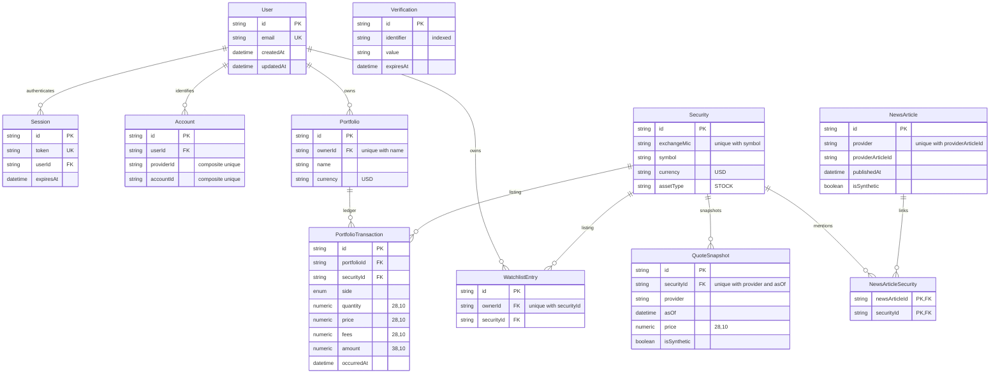

# Database diagram — milestone 06

Every model has createdAt/updatedAt UTC timestamptz(3). Verification is deliberately independent (email/reset identifiers can precede a user). No Position table: derive positions from ordered transactions. Indexes support owner lists, ordered portfolio ledgers, expiry cleanup, symbol discovery, quote history, news chronology and reverse news links. Exact uniques, foreign keys and SQL checks are in the schema/migration; see [database ADR](decisions/0002-database-ledger-and-auth.md) for deletion policy and auth boundaries.
